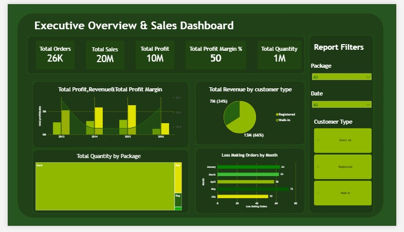

# 📊 FactSale Sales Analysis & Dashboard

### End-to-End Sales Analytics Workflow & Business Insights

<!-- Technologies Badges -->

  
  
  
  
  

---

## 📌 Project Overview

This project delivers an end-to-end analysis of the **FactSale** dataset. The goal is to clean raw transactional data, explore key performance metrics using **Python**, and build an interactive **Power BI** dashboard to uncover revenue drivers, customer behavior, and profit opportunities.

### 🔄 Project Workflow
- 🧹 **Data Cleaning & Validation:** Fixed date types, handled missing entries, and verified metrics using Python.
- 📈 **Exploratory Data Analysis (EDA):** Analyzed trends across products, customers, and sales channels.
- 📊 **Interactive Dashboarding:** Built a dynamic Power BI report with clear KPIs and visuals.
- 💡 **Strategic Action:** Delivered data-backed recommendations to reduce losses and grow sales.

---

## 🛠️ Tools & Technologies

- 🐍 **Python (`pandas`, `numpy`, `matplotlib`, `seaborn`)** — Data cleaning, validation, and EDA.
- 📊 **Power BI (Power Query, DAX)** — Data modeling, KPI calculations, and interactive visual reporting.

---

## 🗂️ Dataset Overview

| Attribute | Details |
|---|---|
| 📄 **Source** | FactSale transactional sales dataset |
| 📏 **Size** | 26,397 rows × 21 columns |
| 📅 **Date Range** | Jan 1, 2013 → May 31, 2016 |
| 🔍 **Grain** | One record per line item (products, customers, salespeople, financial metrics) |

---

## 🧹 Data Cleaning & Quality Checks

The data was validated to ensure **100% mathematical consistency** across all rows:

- 📅 **Date Formatting:** Converted `Invoice Date Key` and `Delivery Date Key` from text to standard `datetime`.
- 🩹 **Missing Values:** Filled 13 missing delivery dates (0.05%) using the verified rule (`Invoice Date + 1 day`).
- 🛡️ **Duplicate Safeguard:** Verified zero duplicate records exist.
- 💡 **Profit Retained:** Kept negative profit entries (2.1%) as they reflect valid financial losses, not data errors.
- 👤 **Customer Segmentation:** Flagged records with Customer Key = 0 as **Walk-in** customers.

---

## ❓ Key Business Questions Solved

- 📈 **Sales Trends:** What are the monthly and annual patterns in sales volume and profit?
- 🛍️ **Product Performance:** Which package types and items drive the highest revenue and margins?
- 👥 **Customer Split:** How much revenue comes from registered vs. walk-in shoppers?
- 🏆 **Salesforce & Regions:** Which cities and sales representatives contribute most to total profit?
- ⚠️ **Loss Monitoring:** When and why do unprofitable transactions occur?

---

## 📊 Power BI Dashboard

*Executive Overview & Interactive Sales Dashboard*

### 🎯 Key Highlights:
- 💳 **Executive KPIs:** Total Orders (26K), Revenue ($20M), Profit ($10M), and Margin % (50%).
- 📉 **Trend Analysis:** Visual tracking of Profit, Revenue, and Margin % over time.
- 🛒 **Customer Distribution:** Revenue share breakdown (66% Walk-in vs. 34% Registered).
- 📦 **Package Demand:** Treemap visualization showing sales volume by packaging style.
- 🚨 **Loss Tracking:** Monthly breakdown of loss-making sales orders.

---

## 💡 Key Business Insights

- 👥 **Walk-in Dominance:** Walk-in customers generate **66% of total revenue ($13M)**.
- 💰 **Healthy Margins:** Profit margin remains stable at **~50%** across core categories.
- 📅 **Loss Seasonality:** Loss-making transactions peak in specific months (e.g., May), pointing to potential discount leakage.
- 📦 **Packaging Preference:** Demand is heavily concentrated in the **"Each"** packaging format.

---

## ✅ Strategic Recommendations

- 🎯 **Convert Walk-ins:** Introduce loyalty perks to convert walk-in shoppers into registered users for better retention tracking.
- 🔍 **Fix Margin Leakage:** Review pricing and promotional rules during peak loss months (May and January).
- 📦 **Optimize Inventory:** Stock top-performing package formats while reducing low-demand SKUs.
- 📚 **Share Best Practices:** Document top sales reps' strategies to train underperforming territories.

---

## 📁 Repository Structure

├── FactSale.csv                   #Rawdataset
├── FactSale_Cleaned.csv       #Cleaneddataset
├── FactSales_Analysis.ipynb #Pythoncleaning & EDA notebook
├── dashboard_overview.jpeg. #Powerdashboard screenshot
└── README.md               #Documentation

---

Made with 🐍 Python + 📊 Power BI

  

<!-- Connect with me Section -->
<h3>📫 Connect with me</h3>

  
  
  

      
